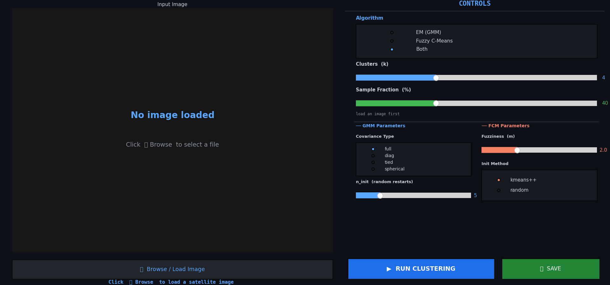

# 🌿 Image Clustering — EM/GMM vs Fuzzy C-Means

A desktop GUI application for **unsupervised pixel-level image clustering** using two algorithms — Expectation Maximization with Gaussian Mixture Models (EM/GMM) and Fuzzy C-Means (FCM). Built with Python and Tkinter, it clusters any PNG or GeoTIFF image, evaluates both algorithms with standard quality metrics, and produces a side-by-side comparison with an inter-algorithm agreement map.



---

## 📋 Table of Contents

- [Overview](#overview)
- [Features](#features)
- [Requirements](#requirements)
- [Installation](#installation)
- [Input Image](#input-image)
- [How to Run](#how-to-run)
- [Usage Walkthrough](#usage-walkthrough)
- [Algorithms](#algorithms)
- [Quality Metrics](#quality-metrics)
- [Output & Results](#output--results)
- [Results Summary (This Project)](#results-summary-this-project)
- [Discussion](#discussion)
- [Project Structure](#project-structure)
- [Team](#team)

---

## Overview

This tool performs **unsupervised clustering** on RGB images by treating each pixel as a 3-dimensional feature vector (R, G, B). Both algorithms operate on the same standardised feature matrix and are evaluated under identical conditions for a fair comparison.

The pipeline is:

```
Load Image → Feature Matrix → Subsample → Fit Model → Assign Labels → Evaluate
(PNG/GeoTIFF)  (R,G,B pixels)  (40% default)  (EM or FCM)   (full image)   (metrics)
                (StandardScaler)               (k clusters)  (chunked 8k)  (Silhouette,
               (valid pixel mask)                            (Hungarian    DB, CH,
                                                              align)        BIC/AIC, PC, PE)
```

---

## Features

- **Two clustering algorithms** — EM/GMM and Fuzzy C-Means, run simultaneously for direct comparison
- **Configurable parameters** — k clusters, covariance type, n_init, fuzziness m, init method, sample fraction
- **6 quality metrics** — Silhouette, Davies-Bouldin, Calinski-Harabász, BIC, AIC, Partition Coefficient, Partition Entropy
- **Inter-algorithm agreement map** — pixel-level disagreement heatmap with overall agreement percentage
- **Cluster pixel distribution chart** — side-by-side bar chart comparing cluster sizes
- **FCM membership maps** — soft membership probability map for each cluster
- **Cluster renaming** — label clusters with semantic names (Water, Vegetation, etc.)
- **Save results** — export classified maps, metrics CSV, and algorithm description text
- **Supports PNG and GeoTIFF** — handles multi-band satellite images and standard RGB photos

---

## Requirements

### Python version

Python **3.8 or higher** is required.

### Dependencies

```
numpy
scikit-learn
scikit-fuzzy
scipy
matplotlib
Pillow
rasterio
```

> Tkinter is included with the standard Python installer on Windows and macOS. On Linux:
> `sudo apt install python3-tk`

---

## Installation

**1. Clone or download this repository**

```bash
git clone https://github.com/<your-username>/<repo-name>.git
cd <repo-name>
```

**2. (Optional but recommended) Create a virtual environment**

```bash
python -m venv venv

# Windows
venv\Scripts\activate

# macOS / Linux
source venv/bin/activate
```

**3. Install dependencies**

```bash
pip install -r requirements.txt
```

---

## Input Image

The image used in this project is included in the `data/` folder:

```
data/
└── A-mature-tree-of-Azadirachta-indica.png     # RGB image of Azadirachta indica (neem tree)
```

The tool accepts any **PNG, JPG, or GeoTIFF** file. For GeoTIFF, the first three bands are used as R, G, B. Pixel values are normalised to [0, 1] using 2nd–98th percentile clipping before clustering.

---

## How to Run

```bash
python clustering.py
```

The GUI window will open. Load your image, set parameters, and click **Run Clustering**.

---

## Usage Walkthrough

### Step 1 — Load Image

- Click **Browse / Load Image** and select a PNG, JPG, or `.tif` file
- The image preview appears on the left panel

### Step 2 — Set Parameters

**Algorithm** — choose EM (GMM), Fuzzy C-Means, or Both (recommended for comparison)

**Clusters (k)** — number of clusters to find (default: 4, range: 2–10)

**Sample Fraction (%)** — percentage of pixels used to fit the model (default: 40%). Lower = faster, higher = more accurate. The fitted model is then applied to the full image.

**GMM Parameters:**

| Parameter | Default | Description |
|---|---|---|
| Covariance type | `full` | Shape of each cluster's covariance (`full`, `diag`, `tied`, `spherical`) |
| n_init | `5` | Number of random restarts — best result is kept |

**FCM Parameters:**

| Parameter | Default | Description |
|---|---|---|
| Fuzziness (m) | `2.0` | Controls overlap between clusters. m=1 → crisp, m→∞ → uniform |
| Init method | `kmeans++` | Initialisation strategy (`kmeans++` or `random`) |

### Step 3 — Run Clustering

- Click **▶ Run Clustering**
- Progress is shown at the bottom status bar
- When complete, the results dashboard appears showing classified maps, the disagreement map, cluster distribution chart, and quality metrics table

### Step 4 — Rename Clusters (optional)

- At the bottom of the results screen, type semantic names for each cluster (e.g. Sky, Foliage, Ground)
- Press Enter to confirm

### Step 5 — Save Results

- Click **💾 Save Results** — exports all outputs to a timestamped folder
- Click **FCM Membership Maps** — shows soft membership probability visualisation for each cluster

---

## Algorithms

### EM / Gaussian Mixture Model

Each pixel is assumed to be drawn from a mixture of k multivariate Gaussian distributions, with parameters: mean vector (μₖ), covariance matrix (Σₖ), and mixing coefficient (πₖ).

**E-Step** — compute posterior responsibility:

```
r(i,k) = πₖ · N(xᵢ | μₖ, Σₖ) / Σⱼ πⱼ · N(xᵢ | μⱼ, Σⱼ)
```

**M-Step** — update parameters to maximise expected log-likelihood:

```
μₖ ← Σᵢ r(i,k)·xᵢ / Σᵢ r(i,k)
Σₖ ← weighted covariance matrix
πₖ ← Σᵢ r(i,k) / n
```

Hard labels are assigned as argmax of posterior responsibilities. Convergence is guaranteed (monotone log-likelihood increase). Full covariance supports elliptical cluster shapes.

Parameters used: `cov_type=full · n_init=5 · max_iter=300 · reg_covar=1e-6`

---

### Fuzzy C-Means

Each pixel i has a membership degree uᵢₖ ∈ [0,1] to every cluster k, with the constraint Σₖ uᵢₖ = 1. The fuzziness exponent m controls overlap.

**Centre update:**

```
vₖ = Σᵢ (uᵢₖ)ᵐ · xᵢ / Σᵢ (uᵢₖ)ᵐ
```

**Membership update:**

```
uᵢₖ = 1 / Σⱼ (dᵢₖ / dᵢⱼ)^(2/(m−1))
```

Convergence: `||U_new − U_old||∞ < ε`. Hard labels assigned as argmax of membership matrix U. Initialised with kmeans++ for stable convergence.

Parameters used: `m=2.0 · max_iter=150 · tol=1e-4 · init=kmeans++`

---

## Quality Metrics

| Metric | Formula | Direction | Applies to |
|---|---|---|---|
| Silhouette Score | `s(i) = (b(i)−a(i)) / max(a(i),b(i))` | ↑ better, range [−1,1] | Both |
| Davies-Bouldin | `DB = (1/k) Σᵢ max_{j≠i} (σᵢ+σⱼ)/d(cᵢ,cⱼ)` | ↓ better, range [0,∞) | Both |
| Calinski-Harabász | `CH = [SS_B/(k−1)] / [SS_W/(n−k)]` | ↑ better, range [0,∞) | Both |
| BIC | `−2·ln(L) + p·ln(n)` | ↓ better | EM only |
| AIC | `−2·ln(L) + 2p` | ↓ better | EM only |
| Partition Coefficient | `PC = Σᵢ Σₖ (uᵢₖ)² / n` | ↑ better, range [1/k,1] | FCM only |
| Partition Entropy | `PE = −Σᵢ Σₖ uᵢₖ·log(uᵢₖ) / n` | ↓ better, range [0,logk] | FCM only |

---

## Output & Results

After running, the following files are saved:

| Output | Description |
|---|---|
| `clusters_EM_<timestamp>.png` | EM/GMM classified map |
| `clusters_FCM_<timestamp>.png` | FCM classified map |
| `results_<timestamp>.png` | Full dashboard (maps, disagreement, metrics, chart) |
| `metrics_<timestamp>.csv` | All quality metrics, run parameters, per-cluster spectral stats |
| `algorithm_description_<timestamp>.txt` | Algorithm equations and parameters |

---

## Results Summary (This Project)

Image: **Azadirachta indica (neem tree), RGB photograph**  
k = **3 clusters** (Sky, Foliage, Ground)  
Sample fraction: **40%**  
Inter-algorithm agreement: **93.9%**

| Metric | EM / GMM | FCM | Winner |
|---|---|---|---|
| Silhouette Score | 0.5882 | **0.6321** | FCM ✓ |
| Davies-Bouldin Index | 0.5245 | **0.4933** | FCM ✓ |
| Calinski-Harabász | 35,175 | **47,101** | FCM ✓ |
| BIC | **−125,607** | N/A | EM ✓ |
| AIC | **−125,924** | N/A | EM ✓ |
| Partition Coefficient | — | 0.8280 | FCM ✓ |
| Partition Entropy | — | 0.3232 | FCM ✓ |
| Time (s) | 5.02 | **0.26** | FCM ✓ |
| Iterations | 8 | 17 | — |

**Per-cluster pixel counts (EM):** C1 = 60,317 · C2 = 78,699 · C3 = 36,221  
**Per-cluster pixel counts (FCM):** C1 = 55,496 · C2 = 78,371 · C3 = 41,370

> Full metrics, spectral statistics per cluster, and run parameters are in [`results/metrics_0205_215716.csv`](results/metrics_0205_215716.csv).

---

## Discussion

**Cluster geometry (Silhouette, DB, CH):** FCM outperforms EM on all three shape-based metrics. FCM's partial membership naturally handles mixed pixels at cluster boundaries — particularly the sky-foliage and foliage-ground transitions in this image.

**Probabilistic model fit (BIC / AIC):** EM performs decisively better. The negative BIC/AIC values indicate a near-perfect Gaussian fit for the 3-class RGB space, reflecting the well-separated colour distributions of sky, foliage, and ground.

**Fuzzy partition quality:** The high PC (0.828, close to 1.0) and low PE (0.323) confirm that clusters are nearly crisp despite FCM's soft assignments — the three colour regions are genuinely well-separated.

**Computational speed:** FCM is ~19× faster on this image (0.26s vs 5.02s). EM's overhead comes from computing full covariance matrices and running n_init=5 restarts.

**Inter-algorithm agreement (93.9%):** Both algorithms identify the same three semantic regions. The 6.1% disagreement is concentrated at boundary pixels where spectral signatures are ambiguous.

**Recommendation:** FCM is preferred for pixel-level segmentation — geometrically superior clusters, substantially faster, and handles boundary overlap gracefully. EM/GMM is the better choice when probabilistic interpretation or model selection via BIC/AIC is required.

---

## Project Structure

```
.
├── clustering.py                                          # Main application
├── requirements.txt                                       # Python dependencies
├── README.md                                              # This file
├── preview_clustering.png                                 # Screenshot of the app UI
├── data/
│   └── A-mature-tree-of-Azadirachta-indica.png           # Input image used in this project
└── results/                                               # Sample outputs from a completed run
    ├── clusters_EM_0205_215716.png
    ├── clusters_FCM_0205_215716.png
    ├── results_0205_215716.png
    ├── metrics_0205_215716.csv
    └── algorithm_description_0205_215716.txt
```

---

## Team

| Name | Roll No. | Institute |
|---|---|---|
| Nitish Kumar Singh | 25D1382 | CSRE, IIT Bombay |
| Rucchik Dilip Rangari | 24B2248 | CSRE, IIT Bombay |
| Srinjoyee Bandyopadhyay | 25M0321 | CSRE, IIT Bombay |

*Submitted for GNR 602 — CSRE, IIT Bombay — February 2026*
